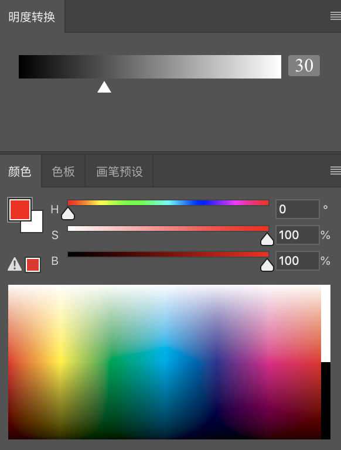

# hsb2gray

在画色彩的时候，如果想要画面丰富度高一些，或者多一些细节，可以通过「藏色」来实现。即将某个颜色用相同明度的颜色给替换一部分。
但是选择「明度相同的颜色」是比较困难的，该插件就是用来解决该问题的。在选择颜色后，能直观给出所选颜色的明度值，再也不用靠猜测了。

[安装与使用说明](https://ltaoo.github.io/color2gray)

## 明度

获取一个颜色的「真实明度值」，不能直接使用「去色」选项，因为感觉很不对，使用「图层混合模式」叠加「饱和度」图层，才是正确的明度值。

该图表示 `hsb(0, 100, 100)` 对应的这个红色，在去除色彩信息后的明度是 30。

只要素描能力强，塑造丰富的色彩以及藏色会变得更加简单明了。

## 参考

- [去色、灰度、黑白的区别？](https://www.zhihu.com/question/28898729)